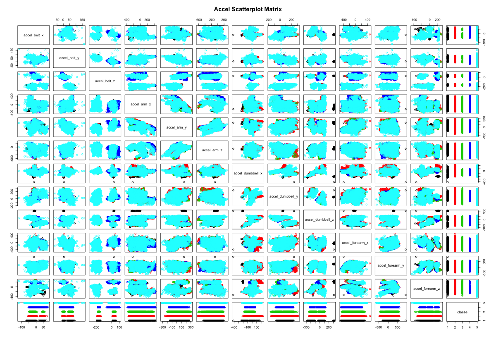
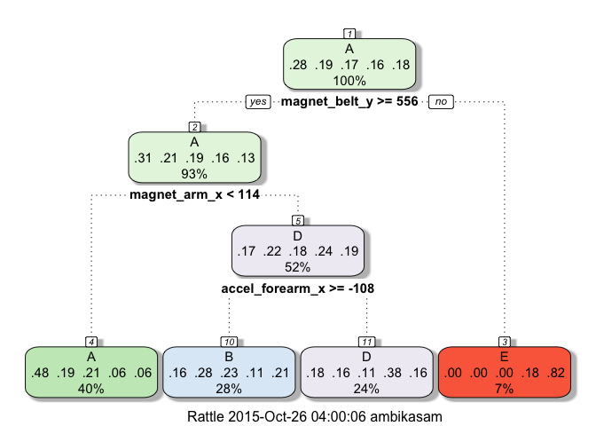
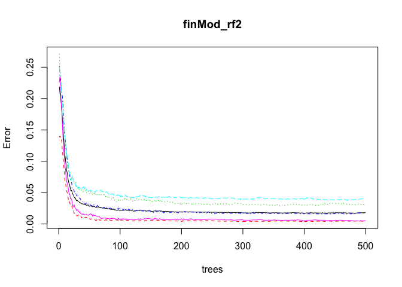
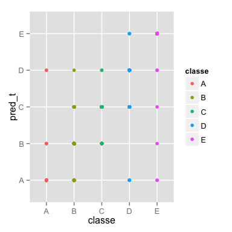
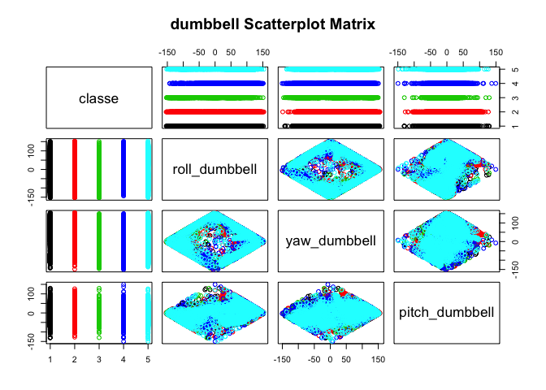

# Machine Learning: Prediction of classe using Weight lifting excersises(Project)
Ambika J, as on 25-Oct-2015  

<style media="screen" type="text/css">

.layer1 {
    margin-left: auto;
    margin-right: auto;
    width: 95%;
    background-color: #b0e0e6;
}

.heading {
    margin: 1px;
    color: #000;
    padding: 3px 10px;
    cursor: pointer; cursor: hand;
    position: relative;
    background-color:#ffffcc;
}
.content {
    background-color:#ffffcc;
}

p { padding: 5px 0; }
</style>


### Executive Summary
**The project guidelines:**  
<UL>
<li> the requirement is  to build a machine learning algorithm to predict activity quality from activity monitors.  
<li> the goal is to use to use data from accelerometers on the belt, forearm, arm, and dumbell of 6 participants.  
<li> data provides how these participants performed barbell lifts correctly and incorrectly in 5 different ways. Classe: A, B, C, D, E.  
</UL>

_As part of building a machine learning prediction algorithm_,  
<UL>
<li> Chose only classe as a factor variable and raw measurement variables which are either int or num variables. Also, variables related to accelerometer.
<li> Peformed EDA to know the type of data (pattern), and it seems to be more like clusters and also a classification problem, thus, we cannot perform linear models on this. Experimented with lvq, k-means and Parallel Random forest but not stated in the project, for the sake of time and space. Other models experimented with lda, qda, glmnet and random forest. Finally, chose random forest.  
<li> Before we train, we have preprocessed data, so that the models would perform well. Like, remove NAs, zero variables and high corelated variables, whereever need be. Also removed a few rows with outliers. [read more on readme.md]  
<li> To predict, we have trained the training data using random forest with cross-validated 10 folds, tested using validation data. Several experiments were conducted and finally concluded on random forest. [read more on readme.md] 
<li> Conducted cross validations on trained data. The different error rates, with different models, are reflected.
<li> We predict the classe that it belongs to. Predict by passing through the pml-testing data, using the model used to train.    
</UL>

### Variable selection
The only factor variable is classe, others are all predictor variables which are continuous variables. We are using only raw measurements for building this algorithm. [For code and details, refer to Appendix C.]

### EDA
To understand the predictor variables, the data patterns, exploratory data analysis was conducted. 

The summary of data is provided in Appedix D, section data.

From the plot of accel scatterplot matrix [Appendix D. section "plot"], it is evident that the data is not linear, thus, we cannot process linear models for machine learning. Similar to accel scatter plot, there are scatter plots for gyros and magnet (which was peformed outside this project).
[For code and details, refer to Appendix D.]

One interesting patter noticed during EDA, refer to Appendix L, if intereseted.

### Data partition
As we have a separate testing data set, splitting this data into only training and validation. The final testing will be performed on the pmltesting data for prediction. [For code and details, refer to Appendix E.]

### Preprocess data
To improve the performance of the algorithm, we need to fine tune predictor variables. We have eliminated the irrelevant fields and rows like NAs and zero variables, highly correlated variables and also outliers. [For code and details, refer to Appendix F2.]

From Gyros and Magnet scatter plots, it is evident that there are some outliers. For variables, gyros\_dumbbell/forearm x/y/z, magnet\_dumbbell\_y. [For code and details, refer to Appendix F1.]

### Models: Experiments (training data)
For all the different experiments conducted - refer to Appendix G.
Experiments conducted on models of randomForest, Trees, lda, qda, nb, glmnet and randomforest with cross-validation.

### Final model selection to train data
After all these experiments with different models, Random forest is the chosen model, due it robustness and accuracy. And in the Random forests, Random forest with 10-fold cross validation is the with the least OOB error rate. Thus, shortlisting this one. We will go ahead with this model for our prediction. The model is modelFit_rf2. [For code, graphs and details, refer to Appendix H.]

### Cross validations
From the plot of Appendix I., it is evident that the data predicted with validation is accurate. Every class predicted is exactly the classe expected. Thus, proves that this model is the right model for this dataset.
[For code, graphs and details, refer to Appendix I.]

### Out of sample error
In the final model chosen, random forest, OOB estimate of error rate is 1.8%. This is the in sample error (resubstitution error). Whereas, With the other random forest model, we see that it was above 6%. Also, note: In-sample-error < out-of-sample-error. 
Out of sample error here, is 0, as it is 100% accuracy in this case.

Also, refer to the graph in Appendix J, We have got 100% accuracy in predicting the validation data set, in this particular experiment and dataset.
[For code, graphs and details, refer to Appendix J.]
  
### Predict testing data
Data is predicted on testing data and the results are published in Appendix K. It was 100% accurate. Thus, this model severed right for this particular case.

### Appendix
#### A: Loading data

```r
## Loading the data
setwd("~/gitdir/coursera/studentcoursera/08_machine_learning/project")
if (!file.exists("data"))  dir.create("data")

## File download and unzip
if(!file.exists("data/pml_training.rds")) {
    if(!file.exists("data/pml-training.csv")) 
        download.file("https://d396qusza40orc.cloudfront.net/predmachlearn/pml-training.csv", 
            destfile = "./data/pml-training.csv", method = "curl")
}

if(!file.exists("data/pml_testing.rds")) {
    if(!file.exists("data/pml-testing.csv")) 
        download.file("https://d396qusza40orc.cloudfront.net/predmachlearn/pml-testing.csv", 
            destfile = "./data/pml-testing.csv", method = "curl")
}
```

#### B. Preprocessing the basic data

```r
if (!"pmltraining" %in% ls()) 
    pmltraining <- read.csv("data/pml-training.csv",na.strings=c("")) 
 
if (!"pmltesting" %in% ls()) 
    pmltesting  <- read.csv("data/pml-testing.csv",na.strings=c("")) 

## Data cleaning
## assuming that this is misspelt for "skewness_pitch_belt" instead of "skewness_roll_belt.1"
names(pmltraining)[names(pmltraining) == "skewness_roll_belt.1"] <- "skewness_pitch_belt"
names(pmltraining)[names(pmltraining) == "var_total_accel_belt"] <- "var_accel_belt"
names(pmltraining) <- sub("_picth_","_pitch_",names(pmltraining))

names(pmltesting)[names(pmltesting) == "skewness_roll_belt.1"] <- "skewness_pitch_belt"
names(pmltesting)[names(pmltesting) == "var_total_accel_belt"] <- "var_accel_belt"
names(pmltesting) <- sub("_picth_","_pitch_",names(pmltesting))
```

#### C. Extract the required fields

```r
## Eliminates all the measurement variables and other variables, like user_name, num_window, new_window and timestamp related, as we are going to predict based on classe, this is the only factor variable, the rest are all numeric values. And consider x/y/z variables and accel related variables. [do not take total_accel and var_accel, as they are derived].
## New set.
taccel1 <- pmltraining[,c(grep("^accel|_x$|_y$|_z$",names(pmltraining)),length(pmltraining))] ## 37 variables
```

#### D. Explorartory Data Analysis
##### data

```r
classAgg <- ddply(taccel1, .(classe), summarise, Max=max(accel_belt_x), Min=min(accel_belt_x),
      Mean=mean(accel_belt_x), Var=var(accel_belt_x), Std.Dev=sd(accel_belt_x))

stargazer(classAgg, type = "html", header = TRUE, out = "table1.html",
        title = "Table 1 Summary by group (classe)", notes = " ",
        rownames = TRUE, digits = 1, style = "all", summary = FALSE)
```


<table style="text-align:center"><caption><strong>Table 1 Summary by group (classe)</strong></caption>
<tr><td colspan="7" style="border-bottom: 1px solid black"></td></tr><tr><td style="text-align:left"></td><td>classe</td><td>Max</td><td>Min</td><td>Mean</td><td>Var</td><td>Std.Dev</td></tr>
<tr><td colspan="7" style="border-bottom: 1px solid black"></td></tr><tr><td style="text-align:left">1</td><td>A</td><td>71</td><td>-68</td><td>-6.3</td><td>875.9</td><td>29.6</td></tr>
<tr><td style="text-align:left">2</td><td>B</td><td>74</td><td>-55</td><td>-4.9</td><td>884.0</td><td>29.7</td></tr>
<tr><td style="text-align:left">3</td><td>C</td><td>60</td><td>-49</td><td>-4.0</td><td>858.7</td><td>29.3</td></tr>
<tr><td style="text-align:left">4</td><td>D</td><td>83</td><td>-53</td><td>-8.3</td><td>759.3</td><td>27.6</td></tr>
<tr><td style="text-align:left">5</td><td>E</td><td>85</td><td>-120</td><td>-4.3</td><td>993.1</td><td>31.5</td></tr>
<tr><td colspan="7" style="border-bottom: 1px solid black"></td></tr><tr><td colspan="7" style="text-align:left"></td></tr>
</table>

```r
taccel <- taccel1[,c(grep("accel",names(taccel1)),length(taccel1))]

stargazer(taccel, type = "html", header = TRUE,
        title = "Table 2 Summary of all the variables", notes = " ",
        summary = TRUE, omit.summary.stat = "n", out = "table2.html",
        rownames = TRUE, digits = 1, style = "all")
```


<table style="text-align:center"><caption><strong>Table 2 Summary of all the variables</strong></caption>
<tr><td colspan="5" style="border-bottom: 1px solid black"></td></tr><tr><td style="text-align:left">Statistic</td><td>Mean</td><td>St. Dev.</td><td>Min</td><td>Max</td></tr>
<tr><td colspan="5" style="border-bottom: 1px solid black"></td></tr><tr><td style="text-align:left">accel_belt_x</td><td>-5.6</td><td>29.6</td><td>-120</td><td>85</td></tr>
<tr><td style="text-align:left">accel_belt_y</td><td>30.2</td><td>28.6</td><td>-69</td><td>164</td></tr>
<tr><td style="text-align:left">accel_belt_z</td><td>-72.6</td><td>100.4</td><td>-275</td><td>105</td></tr>
<tr><td style="text-align:left">accel_arm_x</td><td>-60.2</td><td>182.0</td><td>-404</td><td>437</td></tr>
<tr><td style="text-align:left">accel_arm_y</td><td>32.6</td><td>109.9</td><td>-318</td><td>308</td></tr>
<tr><td style="text-align:left">accel_arm_z</td><td>-71.2</td><td>134.7</td><td>-636</td><td>292</td></tr>
<tr><td style="text-align:left">accel_dumbbell_x</td><td>-28.6</td><td>67.3</td><td>-419</td><td>235</td></tr>
<tr><td style="text-align:left">accel_dumbbell_y</td><td>52.6</td><td>80.8</td><td>-189</td><td>315</td></tr>
<tr><td style="text-align:left">accel_dumbbell_z</td><td>-38.3</td><td>109.5</td><td>-334</td><td>318</td></tr>
<tr><td style="text-align:left">accel_forearm_x</td><td>-61.7</td><td>180.6</td><td>-498</td><td>477</td></tr>
<tr><td style="text-align:left">accel_forearm_y</td><td>163.7</td><td>200.1</td><td>-632</td><td>923</td></tr>
<tr><td style="text-align:left">accel_forearm_z</td><td>-55.3</td><td>138.4</td><td>-446</td><td>291</td></tr>
<tr><td colspan="5" style="border-bottom: 1px solid black"></td></tr><tr><td colspan="5" style="text-align:left"></td></tr>
</table>


##### Plot

```r
### Plots to check how the variables pattern are
## plots - accel
if(!file.exists("accel_scatter_plot.png")) {
    png("accel_scatter_plot.png", width = 1200, height = 820, units = "px");
    pairs( ~ ., data = taccel, main = "Accel Scatterplot Matrix", col = taccel$classe)
    dev.off()
}
## this has about 14 plots, so takes time to plot
```


#### E. Data partition: Training and validation data

```r
### Creating training and validation data set: 60% and 40%
set.seed(3433)
trainIndex <- createDataPartition(taccel1$classe,p=0.6)[[1]]
training = taccel1[trainIndex,]
validation = taccel1[-trainIndex,]
```


#### F1. Removal of irrelevant data from training, after EDA

```r
n = ncol(training)
#n = 3
for (i in 1:n) {
    t <- training[[i]]
    plot(t, main = names(training[i]))
    print(names(training[i])) 
    t1 <- sort(unique(t))
    print(rbind(head(t1, n=6),
    tail(t1, n=6)))
}
```

```r
plot(training$gyros_forearm_y, main = "Plot for gyros_forearm_y", ylab = "gyros_forearm_y")

## From the above code, the plots were verified and these are the variables with outliers and these rows will be removed.
remove_rows <- with(training, accel_forearm_y > 592 | accel_forearm_y < -456 | gyros_forearm_y > 7 | gyros_forearm_x < -3 | magnet_dumbbell_y < -742 | accel_dumbbell_z < -273 | accel_dumbbell_x < -237 | gyros_dumbbell_z > 2 | gyros_dumbbell_y > 3 | accel_belt_y < -54 | accel_belt_y > 92 | gyros_belt_y > 0.56 | gyros_belt_y < -0.45)

training <- training[-remove_rows,]
```

#### F2. Preprocessing

```r
### Eliminating - NA and zero fields; both from training and validation data
### Variability check
training_nzv <- nearZeroVar(training, saveMetrics=T)
training <- training[,!training_nzv$nzv & !training_nzv$zeroVar]
validation  <- validation [,!training_nzv$nzv & !training_nzv$zeroVar]

### eliminated fields
sum(training_nzv$nzv | training_nzv$zeroVar) ##none
```

```
## [1] 0
```

```r
### Correlation of the fields: We are not performing this.
#ncol(training)
trainCorr1 <- cor(training[,-length(training)])
highCorr1 <- findCorrelation(trainCorr1, 0.90)
names(training[,highCorr1])
```

```
## [1] "accel_belt_z"     "gyros_dumbbell_x" "gyros_forearm_z" 
## [4] "gyros_arm_y"
```

```r
training <- training[, -highCorr1]
validation  <- validation [, -highCorr1]
ncol(training) ## 33 variables
```

```
## [1] 33
```


#### G. Experiment with different models
##### ML: Train data: RandomForest

```r
## Train data with Random forest
if (!"modelFitRF" %in% ls()) 
    modelFitRF <- train(classe ~ ., data=training, method="rf", ntree=100)
finModRF <- modelFitRF$finalModel
plot(finModRF)
```

##### ML: Train data: Trees

```r
## Train data with Trees
if (!"modelFitTree" %in% ls()) 
    modelFitTree <- train(classe ~ ., data=training, method="rpart")
finModTree <- modelFitTree$finalModel
fancyRpartPlot(finModTree)
```

 

##### ML: Train data: Combine - lda, qda with nb

```r
## Train data with lda, qda with nb
if (!"modelFit_lda" %in% ls()) 
    modelFit_lda <- train(classe ~ ., data=training, method="lda")
if (!"modelFit_qda" %in% ls()) 
    modelFit_qda <- train(classe ~ ., data=training, method="qda")
if (!"modelFit_nb" %in% ls()) 
    modelFit_nb <- train(classe ~ ., data=training, method="nb")

pred_lda <- predict(modelFit_lda, validation)
pred_qda <- predict(modelFit_qda, validation)
pred_nb  <- predict( modelFit_nb, validation)

table(pred_lda,pred_nb)
```

```
##         pred_nb
## pred_lda    A    B    C    D    E
##        A 1884  129  229  136   70
##        B  107  894   97  153  258
##        C  471   79  798   98   55
##        D  215   30  148  811  132
##        E   37  125   39  134  717
```

```r
table(pred_qda,pred_nb)
```

```
##         pred_nb
## pred_qda    A    B    C    D    E
##        A 1532    7   26   72    3
##        B  311 1094  117  140   55
##        C  667   36 1124  193   11
##        D  141    5   29  826   90
##        E   63  115   15  101 1073
```

**Comparison of Results**  

```r
pred_posb_l <- (pred_lda==pred_nb)
pred_posb_q <- (pred_qda==pred_nb)

p1 <- qplot(accel_arm_x,accel_arm_y,data=validation,colour=pred_posb_l)
p2 <- qplot(accel_arm_x,accel_arm_y,data=validation,colour=pred_posb_q)
grid.arrange(p1, p2, ncol=2)
```

From these comparisons it is evident that False rate is on to the higher side for both lda and qda models when compared to mobel nb.


##### ML: Train data: combine: glmnet and rf

```r
## Train control
trCntrl <- trainControl(classProbs=TRUE, method="cv", number=10, allowParallel=TRUE, returnData=FALSE)

## Train data with glmnet and rf
if (!"modelFit_glm1" %in% ls()) 
    modelFit_glm1 <- train(classe ~ ., data=training, method="glmnet", trControl=trCntrl,
                          metric="Accuracy", maximize=TRUE)

if (!"modelFit_rf2" %in% ls()) 
    modelFit_rf2 <- train(classe ~ ., data=training, method="rf", trControl=trCntrl,
                          metric="Accuracy", maximize=TRUE)

pred_glm <- predict(modelFit_glm1, validation)
pred_rf2 <- predict(modelFit_rf2, validation)
```


```r
qplot(pred_glm,pred_rf2,data=validation,colour=classe)
```

From this plot it is evident, that the combination of these are not appropriate. As the prediction from glmnet and rf2, do not tally. 


```r
table(pred_glm, pred_rf2)
```

```
##         pred_rf2
## pred_glm    A    B    C    D    E
##        A 1807  251  244  109  126
##        B   93  895   85  101  245
##        C  162  125  905  139  100
##        D  136   54  106  736  180
##        E   64  177   58  160  788
```


#### H. Final Model selection

```r
finMod_rf2 <- modelFit_rf2$finalModel
plot(finMod_rf2)
```

 


```r
varImpPlot(finMod_rf2)
```


#### I. Cross Validation

```r
pred_t <- predict(modelFit_rf2, validation)
```


```r
qplot(classe,pred_t,colour=classe,data=validation)
```

 

From this plot it is evident that the data predicted with validation is accurate. Every class predicted is exactly the classe expected. Thus, proves that this model is the right model for this dataset.


```r
confusionMatrix(validation$classe,pred_t)
```

```
## Confusion Matrix and Statistics
## 
##           Reference
## Prediction    A    B    C    D    E
##          A 2227    3    0    2    0
##          B   29 1472   16    1    0
##          C    0   25 1341    2    0
##          D    4    0   42 1237    3
##          E    2    1    1    2 1436
## 
## Overall Statistics
##                                           
##                Accuracy : 0.983           
##                  95% CI : (0.9799, 0.9858)
##     No Information Rate : 0.2883          
##     P-Value [Acc > NIR] : < 2.2e-16       
##                                           
##                   Kappa : 0.9785          
##  Mcnemar's Test P-Value : NA              
## 
## Statistics by Class:
## 
##                      Class: A Class: B Class: C Class: D Class: E
## Sensitivity            0.9845   0.9807   0.9579   0.9944   0.9979
## Specificity            0.9991   0.9928   0.9958   0.9926   0.9991
## Pos Pred Value         0.9978   0.9697   0.9803   0.9619   0.9958
## Neg Pred Value         0.9938   0.9954   0.9909   0.9989   0.9995
## Prevalence             0.2883   0.1913   0.1784   0.1586   0.1834
## Detection Rate         0.2838   0.1876   0.1709   0.1577   0.1830
## Detection Prevalence   0.2845   0.1935   0.1744   0.1639   0.1838
## Balanced Accuracy      0.9918   0.9867   0.9768   0.9935   0.9985
```


```
##                  A       B       C       D       E
## predict    2262.00 1501.00 1400.00 1244.00 1439.00
## validation 2232.00 1518.00 1368.00 1286.00 1442.00
## dif_per       1.33   -1.13    2.29   -3.38   -0.21
## accurcy      98.67   98.87   97.71   96.62   99.79
```


#### J. Out of sample error
In the final model chosen, random forest, OOB estimate of  error rate is 1.8%. This is the in sample error (resubstitution error). Whereas, With the other random forest model, we see that it was above 6%. Also, note: In-sample-error < out-of-sample-error

Out of sample error(generalization error):

```r
table(pred_rf2, pred_t)
```

```
##         pred_t
## pred_rf2    A    B    C    D    E
##        A 2261    0    1    0    0
##        B    1 1501    0    0    0
##        C    0    0 1398    0    0
##        D    0    0    1 1244    0
##        E    0    0    0    0 1439
```

```r
pred_posb_val <- (pred_rf2==pred_t)

## accuracy
mean(pred_posb_val)
```

```
## [1] 0.9996176
```

```r
## out sample error
1 - mean(pred_posb_val)
```

```
## [1] 0.0003823604
```


```r
qplot(accel_arm_x, accel_arm_y, data=validation, colour=pred_posb_val)
```

#### K. Predict on testing set and file creation

```
##  [1] B A B A A E D B A A B C B A E E A B B B
## Levels: A B C D E
```

```
## pred
## A B C D E 
## 7 8 1 1 3
```


#### L. One interesting pattern noticed (dumbbell), during EDA.

```r
newTrain1 <- subset(pmltraining,select=c(grep("^total_|_x$|_y$|_z$|^roll_|^pitch_|^yaw",names(pmltraining)),grep("classe",names(pmltraining))))

pairs(classe~roll_dumbbell+yaw_dumbbell+pitch_dumbbell,data=newTrain1, 
      main="dumbbell Scatterplot Matrix",col=newTrain1$classe)
```

 


#### M. Session Info

```r
sessionInfo()
```

```
## R version 3.2.2 (2015-08-14)
## Platform: x86_64-apple-darwin13.4.0 (64-bit)
## Running under: OS X 10.10.5 (Yosemite)
## 
## locale:
## [1] en_US.UTF-8/en_US.UTF-8/en_US.UTF-8/C/en_US.UTF-8/en_US.UTF-8
## 
## attached base packages:
## [1] grid      parallel  stats     graphics  grDevices utils     datasets 
## [8] methods   base     
## 
## other attached packages:
##  [1] knitr_1.11          gridExtra_2.0.0     plyr_1.8.3         
##  [4] UsingR_2.0-5        Hmisc_3.16-0        Formula_1.2-1      
##  [7] survival_2.38-3     HistData_0.7-5      rattle_3.5.0       
## [10] RGtk2_2.20.31       doParallel_1.0.10   iterators_1.0.7    
## [13] mlbench_2.1-1       e1071_1.6-7         stargazer_5.2      
## [16] klaR_0.6-12         MASS_7.3-43         glmnet_2.0-2       
## [19] foreach_1.4.2       Matrix_1.2-2        rpart.plot_1.5.3   
## [22] rpart_4.1-10        randomForest_4.6-12 caret_6.0-47       
## [25] ggplot2_1.0.1       lattice_0.20-33     R.utils_2.1.0      
## [28] R.oo_1.19.0         R.methodsS3_1.7.0  
## 
## loaded via a namespace (and not attached):
##  [1] gtools_3.5.0        reshape2_1.4.1      splines_3.2.2      
##  [4] colorspace_1.2-6    htmltools_0.2.6     yaml_2.1.13        
##  [7] mgcv_1.8-7          nloptr_1.0.4        foreign_0.8-65     
## [10] RColorBrewer_1.1-2  stringr_1.0.0       MatrixModels_0.4-1 
## [13] munsell_0.4.2       combinat_0.0-8      gtable_0.1.2       
## [16] codetools_0.2-14    evaluate_0.8        latticeExtra_0.6-26
## [19] SparseM_1.7         quantreg_5.19       pbkrtest_0.4-2     
## [22] class_7.3-13        proto_0.3-10        Rcpp_0.12.1        
## [25] acepack_1.3-3.3     scales_0.3.0        formatR_1.2.1      
## [28] BradleyTerry2_1.0-6 lme4_1.1-9          digest_0.6.8       
## [31] stringi_0.5-5       brglm_0.5-9         tools_3.2.2        
## [34] magrittr_1.5        cluster_2.0.3       car_2.1-0          
## [37] minqa_1.2.4         rmarkdown_0.3.10    nnet_7.3-10        
## [40] nlme_3.1-121
```

### References
  
Qualitative Activity Recognition of Weight Lifting Exercises  
Velloso, E.; Bulling, A.; Gellersen, H.; Ugulino, W.; Fuks, H. Qualitative Activity Recognition of Weight Lifting Exercises. Proceedings of 4th Augmented Human (AH) International Conference in cooperation with ACM SIGCHI (Augmented Human'13) . Stuttgart, Germany: ACM SIGCHI, 2013.  
Read more: [Weight Lifting Exercise](http://groupware.les.inf.puc-rio.br/work.jsf?p1=11201#ixzz3oNTQE11n)  

Link: [2013.Velloso.QAR-WLE.pdf](http://groupware.les.inf.puc-rio.br/public/papers/2013.Velloso.QAR-WLE.pdf)
